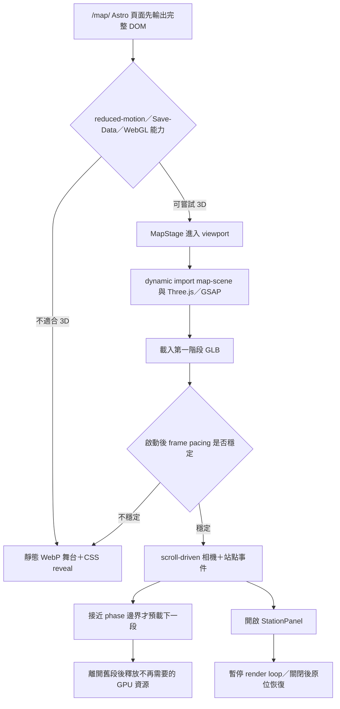

# 裝修導航地圖｜Phase 1 技術選型

> 原始研究結論：若未來改做可自由取景的 GLB 場景，採 Three.js `0.185.1`＋GSAP `3.15.0` / ScrollTrigger，Spline 不作正式 runtime。  
> Demo 最終決策（2026-07-16）：使用確認過的 WebP Keyframe＋語意化 DOM／CSS／原生瀏覽器 API。因畫面已鎖定為單張大翅鯨島鏈，載入 3D runtime 不會增加視覺還原度，因此目前 `/map/` 入口不匯入 Three.js 或 GSAP。原始隔離 benchmark 保留，供未來真的改做 GLB 場景時使用。

## 已驗證的本機現況

- 框架：Astro `^5.0.0`，靜態目錄輸出，`trailingSlash: 'always'`。
- 現有 dependencies：只有 Astro 與 sitemap；未安裝 Three.js、Spline runtime、GSAP 或任何 UI framework。
- 目前網站已有未提交修改；Phase 1 不更動 `package.json`、lockfile、`.astro` 或 CSS。
- `global.css` 已有完整品牌／暖色 tokens，可直接供地圖 UI 使用。
- `/toolbox/` 已有 15 站 waitlist 鳥瞰示意與人物資產使用方式，但其版型不是地圖頁殼。
- 交接硬門檻：單段 3D 資產壓縮後不超過 3MB、桌機中階筆電滾動至少 50fps、行動端降級版 Lighthouse mobile 至少 90。
- 本機套件盤點：`three`、`@splinetool/runtime`、`@splinetool/react-spline`、`gsap` 目前皆未安裝。

## 選型矩陣

| 判斷面向 | Spline Runtime | Three.js＋GSAP | 本案權重 |
|---|---|---|---|
| 建模速度 | 視覺化編輯快，非工程人員較容易調場景 | 需建立 glTF／場景資料與程式控制 | 中 |
| S 型相機路徑 | 能做互動，但複雜捲動同步與精準停靠需再驗證 | 相機位置、目標點、曲線與 timeline 可完全控制 | 極高 |
| 四階段 lazy load／卸載 | 場景切分與資產生命週期需依 runtime 能力驗證 | 可把四段做成獨立 GLB／Group，明確載入、移除與 dispose | 極高 |
| 單一資料源串接 15 站 | 可事件串接，但場景物件名稱與 DOM 資料容易形成雙重維護 | 站點 id、相機 pose、場景節點可由同一份資料映射 | 高 |
| 面板開啟時暫停渲染 | 需驗證 runtime API | 可直接停止 animation loop、暫停 timeline，再原位恢復 | 高 |
| 裝置降級 | 可改載靜態版，但 3D runtime 是否先下載需驗證 | 可在 dynamic import 前完成 feature／效能判定 | 極高 |
| runtime 只進 `/map/` | 可用頁面級 lazy load，實際 chunk 需測 | Astro 頁面專屬動態 import，可明確隔離 | 高 |
| bundle 與記憶體可觀測性 | 待官方資料與實測 | 依模組、renderer 與資產逐項量測 | 高 |
| Astro 現況相容性 | React wrapper 會多帶 UI framework；vanilla runtime 可避開 | 可直接用原生 client module，不必新增 React／Vue／Svelte | 高 |
| 後續 11 站複製生產 | 編輯器操作快，但版本差異與物件命名要嚴格管理 | 場景資料規則建立後，可用同一 loader／pose 格式鋪量 | 高 |

## 為什麼先選 Three.js＋GSAP

1. **本案難點是相機與資產生命週期，不是單站造型。** 15 站要沿同一條路精準停靠，並在四個邊界載入／卸載資產；這需要可程式化掌握相機、場景樹與 dispose。
2. **效能門檻先於建模便利。** 手機預設走靜態舞台，桌機也要能在載入 runtime 前判斷是否降級；原生 dynamic import 比先載一個不可控 viewer 更符合邊界。
3. **Astro 專案目前沒有 UI framework。** 不為了 `client:visible` 額外引入 React。正式做法是 Astro 元件＋瀏覽器端 `IntersectionObserver`，可見後才 `import()` 地圖 runtime，達到 island-like 隔離。
4. **DOM 與 3D 可以保持單向關係。** `mapStations` 是內容真源；3D 只讀 station id、phase、pose 與 scene key，不把文案複製到場景編輯器。
5. **暫停、恢復與回收可明確驗證。** 面板開啟時停止 loop；跨 phase 時移除上一段 Group、釋放 geometry／material／texture；這些都能寫成測試清單。

Spline 的優勢保留在「快速做模型／試擺」層，但在官方研究前不先宣稱能否可靠匯出、分段或自架。若 Phase 1 實測證明 Spline runtime 同時通過資產分段、停幀控制、bundle 與幀率門檻，再重新評估；不是因為建模快就直接上正式頁。

## Astro 端實作姿勢

本案不新增 React integration。建議的執行鏈如下：



### 建議檔案邊界（Phase 2 才建立）

```text
src/pages/map.astro
src/components/map/MapStage.astro
src/components/map/ProgressRail.astro
src/components/map/StationPanel.astro
src/components/map/PhaseGate.astro
src/data/mapStations.ts
src/data/mapCameraPoses.ts
src/scripts/map/bootstrap.ts
src/scripts/map/scene.ts
src/scripts/map/performance-tier.ts
public/map/scenes/phase-01.glb
public/map/scenes/phase-02.glb
public/map/scenes/phase-03.glb
public/map/scenes/phase-04.glb
public/map/posters/station-s01.webp ... station-s15.webp
```

- `map.astro`：輸出 H1、15 個 `<section id="sNN">`、Email gate 殼與所有 SEO 文字。
- `MapStage.astro`：只提供舞台容器、poster 與 canvas mount，不持有內容文案。
- `bootstrap.ts`：先做降級判定，只有通過才載入 `scene.ts`。
- `scene.ts`：建立 renderer、camera、phase groups、相機 timeline 與資源回收。
- `mapStations.ts`：站名、phase、status、hook、tool、characters、D1 callback key。
- `mapCameraPoses.ts`：站點相機位置與 look-at；避免把相機數值混進內容檔。

## 3D 資產策略

- 正式交換格式優先用 glTF／GLB；建模工具不綁死在 runtime。
- 四個 phase 各一個主要資產包，遵守交接書的單段壓縮後不超過 3MB。
- 共用人物、鯨魚與材質若重複出現，要由資產清單決定共用或複製的成本；不先用肉眼猜哪個比較省。
- 模型壓縮、貼圖格式與尺寸要用實際畫質／載入結果決定；Phase 1 不虛設 Draco、Meshopt、KTX2 的必用結論，等垂直切片測完再鎖。
- 每站只保留一個主動作；不做骨骼角色長動畫。能用 transform、材質參數或少量 morph 表現的，不增加完整動畫 clip。
- 全頁只維持一個 WebGL canvas；不為 15 站各建一個 renderer。

## 效能分級

### 進入 3D 前

以下任一成立即直接走靜態版：

- `prefers-reduced-motion: reduce`
- 瀏覽器要求節省資料
- 無 WebGL／建立 context 失敗
- 主要資產下載或解碼失敗

裝置記憶體、CPU 核心數與 GPU capability 只能作提示，不能單獨決定。部分瀏覽器不提供完整裝置資訊，因此正式判斷要加上短時間 runtime frame pacing；不使用 UA 字串猜 iPhone 或 Android。

### 進入 3D 後

- 啟動後先跑不影響使用者的短取樣，再決定維持完整 3D 或切回 poster。
- 若連續取樣顯示無法守住交接門檻，儲存本次降級狀態並切靜態版，不讓使用者反覆在兩模式間閃動。
- 分頁進入背景、面板開啟或舞台離開 viewport 時暫停 loop。
- WebGL context lost 時顯示目前站 poster 與 DOM，不自動無限重建。

## 行動端技術路徑

- 行動端預設不載 3D runtime；15 站用預渲染 WebP、`<picture>` 與 CSS reveal。
- HTML、ProgressRail、StationPanel、Email gate、hash、`?ch=` 與 callback 介面跟桌機共用。
- 不把完整 3D 畫布先載入再用 CSS 隱藏。
- 不用長影格序列當預設；只有某個關鍵 reveal 在單張圖無法表達且經實測通過預算時才考慮。
- Lighthouse mobile 至少 90 是降級版正式驗收門檻；要在代表性行動設定與正式圖片接入後量測。

## 可及性與 SEO

- canvas `aria-hidden="true"`；所有站點與工具觸發器存在於 DOM。
- 15 個站點使用語意化 section 與 H2，順序就是裝修順序。
- `ProgressRail` 使用真正的錨點連結；無 JS 仍能到站。
- `StationPanel` 使用 dialog／drawer 的焦點管理、Esc 關閉與觸發點回焦。
- 靜態版不是錯誤頁，而是同等內容的正式呈現。

## 埋點與接線邊界

Phase 2 只預留 callback，不直接接 D1 或 MailerLite：

```ts
type MapCallbacks = {
  onStationView?: (stationId: string) => void;
  onToolOpen?: (stationId: string) => void;
  onMapComplete?: () => void;
  onEmailUnlockRequest?: (stationId: string) => void;
  onWaitlistRequest?: (stationId: string) => void;
};
```

實際事件名、去重、Email 送出與 D1 寫入由畢寶接線；3D 模組不得直接呼叫資料庫。

## 隔離實測結果

### Production bundle（raw / gzip-9）

| 測試組 | Raw JS | Gzip JS |
|---|---:|---:|
| baseline | 736 B | 419 B |
| GSAP＋ScrollTrigger | 114,057 B | 44,366 B |
| Three.js 最小可渲染場景 | 514,668 B | 127,561 B |
| Three.js＋GSAP | 628,724 B | 171,640 B |
| Spline Runtime（全部署 chunks、未載 scene） | 4,552,604 B | 1,443,935 B |
| Spline＋GSAP | 4,667,214 B | 1,488,349 B |

- Spline＋GSAP 的全部署 gzip 約為 Three.js＋GSAP 的 `8.67 倍`。
- Spline 單看初始主 chunk 仍為 `2,034,493 B raw / 565,592 B gzip`，且尚未包含 `.splinecode` 場景資產。
- Three.js＋GSAP 相較 Three.js 的 GSAP gzip 增量為 `44,079 B`；Spline＋GSAP 相較 Spline 的增量為 `44,414 B`。

### 無正式場景初始化（headless Edge）

環境為 Windows 11 `10.0.22631`、Edge 150、Node `24.13`、i7-10750H；每組七個獨立 context 取中位數，使用 SwiftShader 與 localhost。

| 測試組 | ready | JS heap | task |
|---|---:|---:|---:|
| baseline | 57.0 ms | 1,201,352 B | 39.996 ms |
| Three.js | 146.8 ms | 2,317,588 B | 104.308 ms |
| Spline | 316.1 ms | 4,083,688 B | 168.740 ms |
| GSAP | 95.9 ms | 1,945,512 B | 98.876 ms |
| Three.js＋GSAP | 162.0 ms | 3,118,968 B | 142.334 ms |
| Spline＋GSAP | 322.2 ms | 4,810,016 B | 226.766 ms |

公平限制：沒有同內容、同面數、同材質、同貼圖與同燈光的 `.splinecode`／Three 場景，因此不能聲稱 FPS 勝負。這裡能證明的是 runtime/bundle 與無場景初始化成本。

### 授權與官方依據

- Three.js：MIT。[官方安裝](https://threejs.org/manual/en/installation.html)、[官方授權](https://threejs.org/license/)。
- GSAP：Standard no-charge license 可用於一般商業網站，但不是 MIT，並限制用來建立與 Webflow 競爭的視覺動畫建置工具。[安裝](https://gsap.com/docs/v3/Installation/)、[ScrollTrigger](https://gsap.com/docs/v3/Plugins/ScrollTrigger/)、[授權](https://gsap.com/community/standard-license/)。
- Spline runtime：npm manifest 未宣告 license、套件也未附 LICENSE；若未來採用需另向 Spline 確認。[runtime](https://www.npmjs.com/package/@splinetool/runtime)、[code export](https://docs.spline.design/exporting-your-scene/web/exporting-as-code)。
- Astro 無屬性 `<script>` 會處理 npm import、bundle 與去重。[官方 client scripts](https://docs.astro.build/en/guides/client-side-scripts/)。

### 重現方式

結果檔位於 `C:\tmp\map-tech-benchmark\results-sizes.json`、`results-runtime-summary.json` 與 `results-runtime-samples.json`。

```powershell
cd C:\tmp\map-tech-benchmark
npm.cmd install --ignore-scripts --no-audit --no-fund
npm.cmd run build
npm.cmd run sizes
npm.cmd run bench
```

## 選型翻案條件

只有在 Spline runtime 的代表性測試同時證明以下事項時，才翻案改用 Spline：

- 可在 `/map/` 可見前完全不下載 runtime。
- 四階段可按交接規格獨立載入，且單段資產預算可守住。
- 相機能沿同一路線精準同步滾動並可靠停靠 15 站。
- 面板開啟能真正停止渲染，關閉後原位恢復。
- 中階裝置與靜態降級切換均通過門檻。
- Astro 不需為 wrapper 額外引入不必要的 UI framework。

若任一關鍵條件不成立，正式 runtime 維持 Three.js＋GSAP；Spline 最多只作視覺試擺工具。

## 證據狀態

- [x] 官方來源、版本與授權資料
- [x] production bundle 的 raw／gzip 數字
- [x] 無正式場景初始化中位數與公平限制
- [x] 最終選型簽核
- [ ] 正式頁 phase lazy load／dispose 實測
- [ ] 正式頁桌機 frame pacing
- [ ] 行動靜態版 Lighthouse mobile
